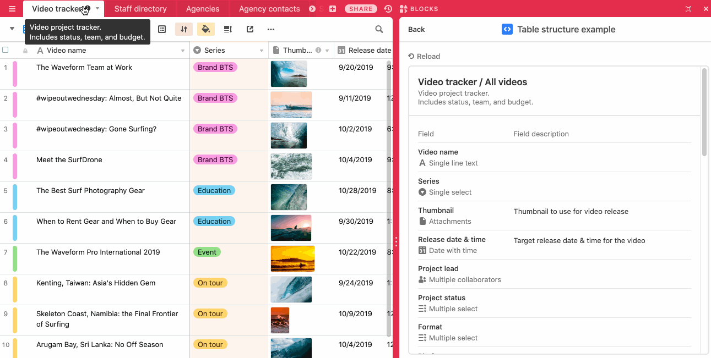

# My-Stock-Block
Manage the stock of items for a Shop or a Warehouse utility including creation of alert and personnalized KPI

This block work with Airtable. It is description bellow how to install and configure your block

The Project offer :

-   How to check the stock

-   How to add user, and create personalized KPI for each user

-   Personnalized the design to 

## How to run this block

1. Create a new base using the
   [Digital video production template](https://airtable.com/templates/content-production/expKOGNEdcF0gmFW3/digital-video-production).
   (You can also use an existing base or a different template: this block doesn't depend on any
   specific attributes from that template.)

2. Create a new block in your new base (see
   [Create a new block](https://airtable.com/developers/blocks/guides/hello-world-tutorial#create-a-new-block),
   selecting "Table structure" as your template.

3. Follow the instruction

4. From the root of your new block, run `block run`.

## See the block running

